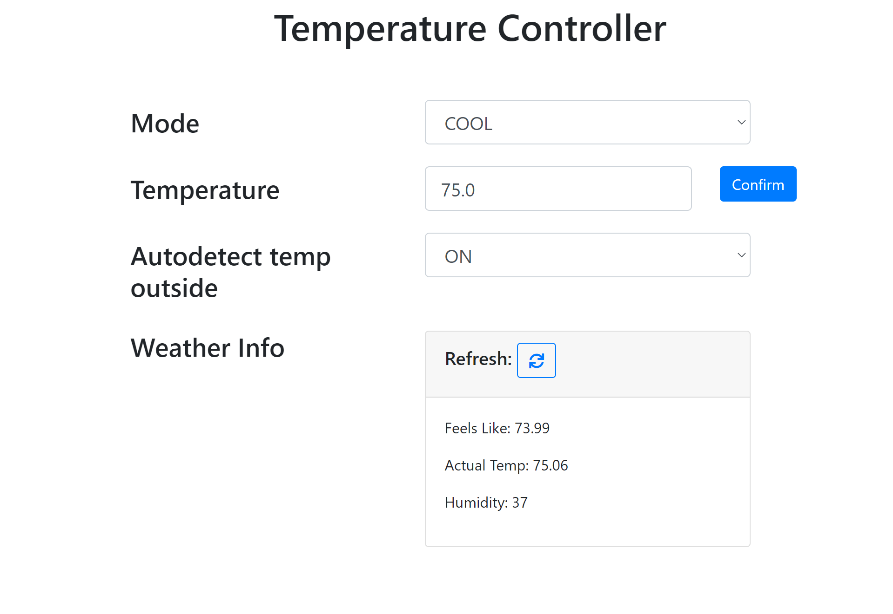

# Google Nest Auto Temp Controller

A tool to automatically control my Nest Home thermostat to automatically turn off when the outside temperature is cooler than the inside AC. 

## Tech Stack:
### Backend:
- [Node.js](https://nodejs.dev/)
- [Express](https://expressjs.com/)
### Frontend:
- [React.js](https://reactjs.org/)
  - [React-Bootstrap](https://react-bootstrap-v4.netlify.app/)
### APIs and Device
- [Google Nest Home Device](https://store.google.com/us/category/connected_home?hl=en-US)
  - [Google Device Access Console](https://console.nest.google.com/u/1/device-access/project-list)
  - [Google Smart Device Management API](https://developers.google.com/nest/device-access/get-started)
- [Open Weather API](https://openweathermap.org/current)

## Current Goals:
- Make it adoptable for others

## Contributing
Pull requests are welcome. For major changes, please open an issue first to discuss what you would like to change.

Please make sure to update tests as appropriate.

## License
[MIT](https://choosealicense.com/licenses/mit/)
